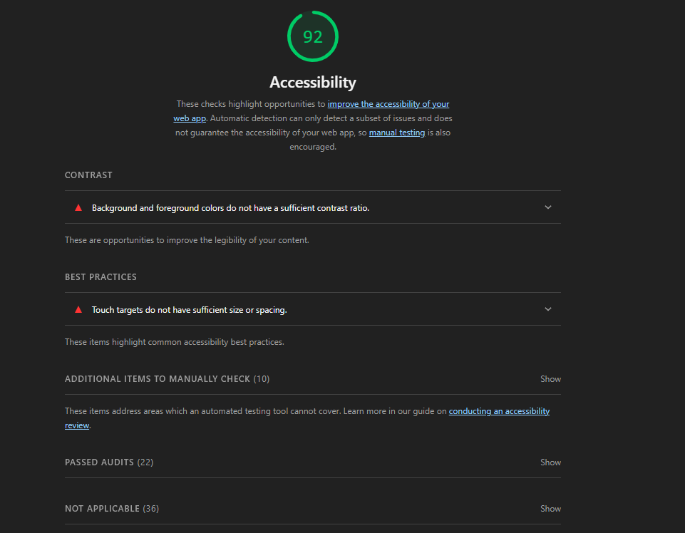

# Web LAB-2: Semantik ve Erişilebilir Portfolyo

## Hakkinda
[cite_start]Bu proje, Web Tasarimi ve Programlama dersi LAB-2 kapsaminda Semantik HTML5 ve Erişilebilirlik (a11y) prensiplerine uygun olarak geliştirilmiştir[cite: 682, 689].

## Gelistirici
[cite_start]**Ad Soyad:** Mert Sarıtop [cite: 1182]
**Ogrenci No:** [Numaran]

## Erişilebilirlik Skoru (Lighthouse)

[cite_start]*Erişilebilirlik puanı: 90+* [cite: 1272, 1344]

## Kullanilan Özellikler
* [cite_start]**Semantik Yapı:** header, nav, main, section, article, footer etiketleri[cite: 741, 744, 747, 750, 753, 759].
* [cite_start]**Erişilebilirlik:** Skip Link, ARIA etiketleri ve doğru heading hiyerarşisi[cite: 856, 943, 994, 1226].
* [cite_start]**Form Doğrulama:** HTML5 tabanlı istemci tarafı doğrulama (required, minlength vb.)[cite: 1079].